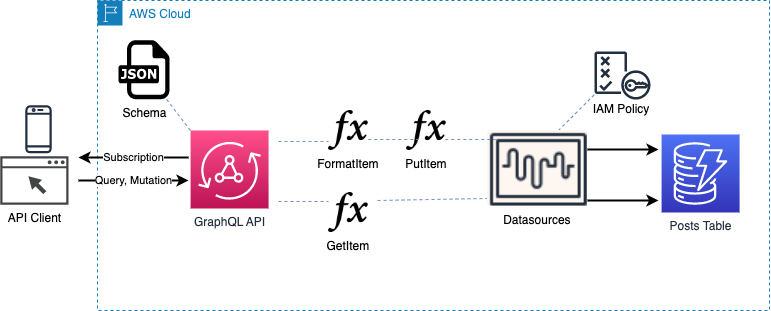
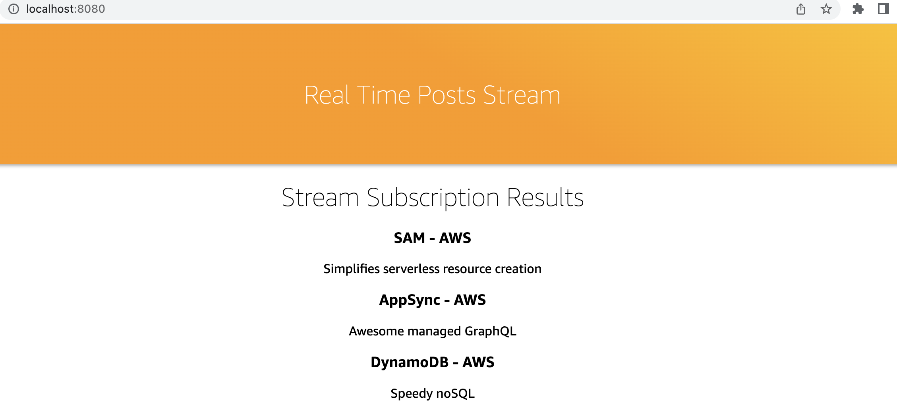

# AWS SAM: Deploying GraphQL

This repository includes a sample application and demonstrates how to deploy and test the new [AWS::Serverless::GraphQLApi](https://docs.aws.amazon.com/serverless-application-model/latest/developerguide/sam-resource-graphqlapi.html) resource for AWS Serverless Applicaiton Model (SAM). This project is a companion to the blog [Introducing AWS SAM generated resources for GraphQL](https://aws.amazon.com/blogs/mobile/aws-sam-now-supports-graphql-applications-with-aws-appsync/).

You can accelerate your AppSync API development with SAM using `AWS::Serverless::GraphQLAPI`. SAM simplifies the createion of AppSync API schemas, functions, resolvers, datasource connectors and API credentials. SAM also creates the required IAM resources with the principle of least privilidge.

When you deploy this application it will create an AppSync API to your account including the following:

1. An AppSync API including a schema, functions, resolvers, API Key
2. A DynamoDB table
3. IAM policies required for the API to interact with the DynamoDB table and CloudWatch metrics and logs

## Prerequisites

To deploy this sample application, you will need:

- Access to an AWS account with permissions to create CloudFormation stacks, AppSync APIs, AWS Identity and Access Management (IAM) roles and polices, and DynamoDB tables
- The SAM CLI installed in your environment, version >= 1.88.0.
- Node.js installed in your environment.
- A git CLI installed in your environment.
- The curl CLI utility installed in your environment
- Familiarity with GraphQL, JavaScript and NoSQL are beneficial, but not required.

This application was built and tested in AWS Cloud 9 on Amazon Linux 2 and on a Mac. You may need to make minor changes to the commands if you are not using a bash shell in your CLI terminal.

## Application Architecture

This application consists of a SAM template, a graphql schema, JavaScript function resolvers, and a simple UI . Refer to the following diagram.



## Developing AppSync APIs

When you are developing AppSync API Functions, you can use the [aws-appsync/utils](https://www.npmjs.com/package/@aws-appsync/utils) library in your code to simplify operations that interact with supported resources like DynamoDB. Reference the AppSync [documentation](https://docs.aws.amazon.com/appsync/latest/devguide/resolver-util-reference-js.html) to learn more.

When you build web pages that interact with AppSync, you can use the [aws-amplify](https://docs.amplify.aws/lib/graphqlapi/mutate-data/q/platform/js/) package to simplify building AppSync interactions into your UI code. Exploring the `src\app.js` file provides an example of this for the AppSync subscription example in this project.

## Deploy the application

To get started clone this repository:

```bash
git clone https://github.com/aws-samples/aws-sam-transform-aws-appsync.git
cd aws-sam-transform-aws-appsync
```

The next step is to deploy this application to your AWS account so that you can explore the resources it creates and try interact with the GraphQL API. Run the `sam deploy --guided` command and accept all the defaults.

```bash
sam deploy --guided
```

Once your deployment completes, you can see outputs printed in your terminal for both your API endpoint and your API key which you’ll need to test the application. Copy these to a scratch file for use in the following steps. You can also view and retrieve these values by navigating to the CloudFormation console, choosing your stack and reviewing the outputs tab.

## Testing the API

To interact with your API using the curl command you can run the provided sample commands that follow. You’ll need to replace <API-KEY> with your API Key and <APPSYNC-API-ENDPOINT> with your API Endpoint that you saved into a scratch note. Copy the command below, replace the placeholders including angle brackets with your output values, and paste it into your terminal and hit Enter.

```bash
  curl \
  --request POST \
  --header 'Content-Type: application/json' \
  --header 'x-api-key: <API_KEY>' \
  --data '{ "query": "mutation AddPost { addPost(author: \"Anonymous\", content: \"Lorem ipsum dolor sit amet, consectetur adipiscing elit, sed do eiusmod tempor incididunt ut labore et dolore magna aliqua. Ut enim ad minim veniam, quis nostrud exercitation ullamco laboris nisi ut aliquip ex ea commodo consequat. Duis aute irure dolor in reprehenderit in voluptate velit esse cillum dolore eu fugiat nulla pariatur. Excepteur sint occaecat cupidatat non proident, sunt in culpa qui officia deserunt mollit anim id est laborum.\", title: \"A simple post\") { author content id } }" }' \
  <APPSYNC_API_ENDPOINT>
```

Capture the value of the post “id” field from the response so that you can use it in a query against API to retrieve your post.

```bash
  curl \
  --request POST \
  --header 'Content-Type: application/json' \
  --header 'x-api-key: <API_KEY>' \
  --data '{ "query": "{ getPost(id: \"<POST_ID>\") { id author title content version ups downs } }" }' \
  <APPSYNC_API_ENDPOINT>
```

The response will contain similar data to the response from your initial AddPost mutation query, but this getPost query defined more response fields in the GraphQL query. If you inspect the function code in the file `sam_graphql_api/formatPostItem.js` you’ll see that this JavaScript revolver function not only sets up the unique ID for our DynamoDB record, but also sets a version and some up and down vote values for the post. If you look into your SAM `template.yml` file in the Resolvers section you can see that formatPostItem runs prior to createPostItem so that any modifications it makes to the request values are persisted into DynamoDB. If you look at the Functions section in your template.yml you’ll see that formatPostItem declares a NONE data source and createPostItem references the DynamoDB PostsDataSource defined at the top of the file as an `AWS::Serverless::SimpleTable` You can also view records created with AddPost in the DynamoDB item explorer console.

## Subscribing to updates

The sample application includes a single page application that you can run locally with the npm CLI command of Node.js. To start, configure your application in the `src/exports.js` file. Replace <API-KEY> with your API key and <APPSYNC-API-ENDPOINT> with your API Endpoint and <REGION> with the region where you deployed your application. Be sure only to replace the <API_KEY> placeholder surrounded by angle brackets for the `aws_appsync_apiKey` property and not the `aws_appsync_authenticationType` property.

```js
const awsmobile = {
  aws_project_region: "<REGION>",
  aws_appsync_graphqlEndpoint: "<APPSYNC_API_ENDPOINT>",
  aws_appsync_region: "<REGION>",
  aws_appsync_authenticationType: "API_KEY",
  aws_appsync_apiKey: "<API_KEY>",
};

export default awsmobile;
```

With your `src/exports.js` updated and saved, you are now ready to start your webserver and view some real time posts streamed from your subscription. Run the following commands to install, build and run the web application.

```
# uncomment AWS_SDK_LOAD_CONFIG for externally configured credentials (any type of federation, SSO)
# https://docs.aws.amazon.com/sdk-for-javascript/v2/developer-guide/loading-node-credentials-configured-credential-process.html
# export AWS_SDK_LOAD_CONFIG=1
npm install
npm run build
npm run start
```

Once the application is running locally, open the address http://localhost:8080/ in a browser. Next, send some test posts to the API so that you can see them displayed on the single page application in real time. Again, you’ll need to replace <API-KEY> with your API key and <APPSYNC-API-ENDPOINT> with your API Endpoint before you paste and run the command in your terminal. For this step you’ll need to open a second terminal as the original terminal you opened is running the web server.

```bash
curl \
--request POST \
--header 'Content-Type: application/json' \
--header 'x-api-key: <API_KEY>' \
--data '{ "query": "mutation AddPost { addPost(author: \"AWS\", content: \"Simplifies serverless resource creation\", title: \"SAM\") { author title content id ups downs version} }" }' \
<APPSYNC_API_ENDPOINT>
curl \
--request POST \
--header 'Content-Type: application/json' \
--header 'x-api-key: <API_KEY>' \
--data '{ "query": "mutation AddPost { addPost(author: \"AWS\", content: \"Awesome managed GraphQL\", title: \"AppSync\") { author title content id ups downs version} }" }' \
<APPSYNC_API_ENDPOINT>
curl \
--request POST \
--header 'Content-Type: application/json' \
--header 'x-api-key: <API_KEY>' \
--data '{ "query": "mutation AddPost { addPost(author: \"AWS\", content: \"Speedy noSQL\", title: \"DynamoDB\") { author title content id ups downs version} }" }' \
<APPSYNC_API_ENDPOINT>
```

If everything worked correctly you should see output on your page similar to the following screenshot. If you open your browsers development tools and view the console when you issue AddPost mutation requests, you’ll also see the AWSAppSyncRealTimeProvider response printed to the console. You can explore the value of the response to understand how to interact with this data in JavaScript. The file src/app.js has the AWS Amplify JavaScript library included and provides a working example of how to subscribe to your API and manipulate messages.



## Cleanup

To avoid accruing charges for the resources you created following the instructions in this blog post, run sam delete to remove all cloud resources.

```bash
sam delete
```
